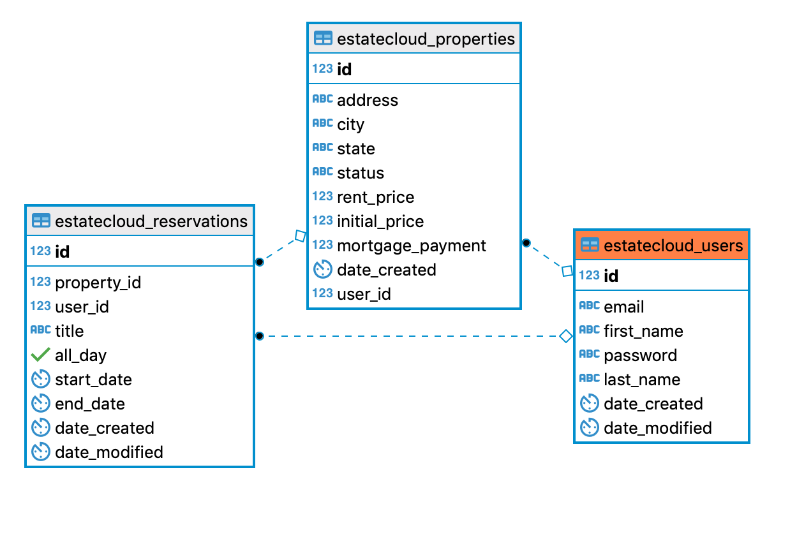

# EstateCloud Server

## Table of Contents
- [Introduction](#introduction)
- [Tech Stack](#tech-stack)
- [Server Structure](#app-structure)
- [Table Schema](#table-schema)
  - [User Format](#user-format)
  - [Property Format](#property-format)
  - [Reservation Format](#reservation-format)
- [API Endpoints](#api-endpoints)
  - [Users](#users)
  - [Authentication](#authentication)
  - [Properties](#properties)
  - [Reservations](#reservations)
  - [Friends](#friends)

## Introduction
This is the server documentation for [EstateCloud](https://estatecloud-app.nataliesun.now.sh/), a property management app complete with scheduling capabilities and graphical representation of the availability.

## Tech Stack
> TheEstateCloud server is powered by
* Node
* Express
* Postgresql
* Morgan
* BCryptJS
* JSONWebToken
* Moment
* dotEnv
* Mocha
* Chai

## App Structure
EstateCloud follows Node's convention of processing codes from top to bottom and left to right. The most-used routes will be placed at top, followed by lesser-used routes, and finally error handlers.

> Route hierarchy
```
Users
Authentication
Properties
Reservations
Friends
```

Application data is persisted via Heroku Postgres. RESTful API architecture is also used for data creation and retrieval.


## Table Schema
EstateCloud uses Postgresql relational databases. 
There are three tables: Users, Properties, and Reservations.
Each item in users, properties and reservations has a unique id.
The user_id column in properties and reservations references the id in users.
The property_id column in reservations references the id in properties.




### User Format
```
email: {
  type: String,
  required: true,
  unique: true
},
password: { type: String, required: true },
firstName: { type: String, required: true },
lastName: { type: String }
```
While `email` is stored as a string, its route handlers will ensure that it is a proper email format.

### Property Format
```
id: { type: Integer, unique },
address: { type: String, required: true },
city: { type: String, required: true },
state: { type: String, required: true },
status: { type: String, default: null },
rent_price: { type: Integer, required: true },
initial_price: { type: Integer, required: true },
mortgage_payment: { type: Integer, required: true },
user_id: { type: Integer, ref: User.id },
```
Frontend displays property stats.

### Reservation Format
```
id: { type: Integer, unique },
property_id: { type: Integer, ref: Property.id, required: true },
user_id: { type: Integer, ref: User.id, required: true },
title: { type: String, required: true },
all_day: { type: Boolean },
start_date: { type: Timestamp, required: true },
end_date: { type: Timestamp, required: true },
date_created: { type: Timestamp, required: true },
date_modified: { type: Timestamp }
```
Reservation is used for front-end calendar showing dates of availability.

## API Endpoints
All requests and responses are in JSON format.

Action | Path |
--- | --- |
Users | https://estatecloud-server.herokuapp.com/api/users |
Authentication | https://estatecloud-server.herokuapp.com/api/auth |
Properties | https://estatecloud-server.herokuapp.com/api/properties |
Reservations | https://estatecloud-server.herokuapp.com/api/reservations |
Friends | https://estatecloud-server.herokuapp.com/api/friends |

### Users
> `POST` request to endpoint `/` is for creating users. 

It accepts the following request body,
```
{
  email,
  password,
  first_name,
  last_name // optional
}
```
`email` will be rejected if it is not a unique email. 

Once a user is successfully created, this will be the server's response.
```
{
  id,
  email,
  first_name,
  last_name
}
```

> `GET` request to endpoint `/userName` will return the logged in user's name.

 The following is the server's response,

```
{
  first_name
}
```

> `PUT` request to endpoint `/password` will modify a user's password. 

It accepts the following request body,
```
{
  oldPassword,
  newPassword
}
```
This route will make sure that old password matches with current password before hashing and reassigning the new password.

`DELETE` request to endpoint `/delete` will remove a user entirely from the database. This will also remove all properties and reservations made by the user.

### Authentication
> `POST` to `/login` endpoint for creation of JWT. 

It accepts the following request body,
```
{
  email,
  password
}
```
This endpoint takes in the email and verifies the password. When validated, the server will respond with a token,
```
{
  authToken
}
```

> `POST` to `/refresh` will send back another token with a newer expiriation. No request body is necessary as an existing and valid JWT must be provided to access this endpoint.

### Properties
> `POST` to `/` will create a property. The property object contains an address, city, state, and financial inforamtion. 

It accepts the following request body,
```
{
  address,
  city, 
  state,
  status,
  rent_price,
  intial_price,
  mortgage_payment
}
```

> `GET` request to `/` will respond with all property objects created by the user logged in.

> `GET` request to `/:property_id` will respond with the property object with and id that matches `property_id`.

> `PATCH` request to `/:property_id` will modify the property with and id that matches `property_id`. 

It accepts the following request body,
```
{
  address,
  city, 
  state,
  status,
  rent_price,
  intial_price,
  mortgage_payment
}
```

> `DELETE` request to `/:property_id` will delete the property with and id that matches `property_id`. 

The server will respond with status 404 if the property does not exist and the property_id if sucessfully deleted.


### Reservations

> `POST` request to `/` will insert a reservation object into the database. The `property_id` maps the reservation to a certain property.

It accepts the following request body,
```
{
  title,
  start_date,
  end_date,
  property_id
}
```

> `GET` request to `/` will respond with the of the reservations in the database.

The response body is as follows,

```
{
  id,
  user_id,
  title,
  start,
  end,
  all_day //default true,
  property_id,
  date_created
}
```

> `GET` request to `/user` will respond with the number of reservations at properties owned by the user as well as made. 

The response body is as follows,

```
{
  owned: int,
  made: int
}
```

> `GET` request to `/property/:property_id` will return the reservations for at a given property matching `property_id`.

The response body is as follows,
```
{
  id,
  user_id,
  title,
  start,
  end,
  all_day,
  property_id,
  date_created
}
```

> `GET` request to `/reservation/:reservation_id` will return the details of a reservation for a given reservation matching `reservation_id`. It joins the Users table with reservations.

The response body is as follows,
```
{
  res_user,
  res_id,
  first_name,
  date_created
}
```


> `DELETE` request to `/:reservation_id` will delete a reservation with id matching `reservation_id`. The server will respond with status 404 if it does not exist and the deleted reservation id if sucessful.

### Friends

`GET` request to `/:user_email` will check if the given email exists in EstateCloud. If it does, then it will return the properties that that user's email posted.

The response is as follows,

```
{
  address,
  id
}
```
